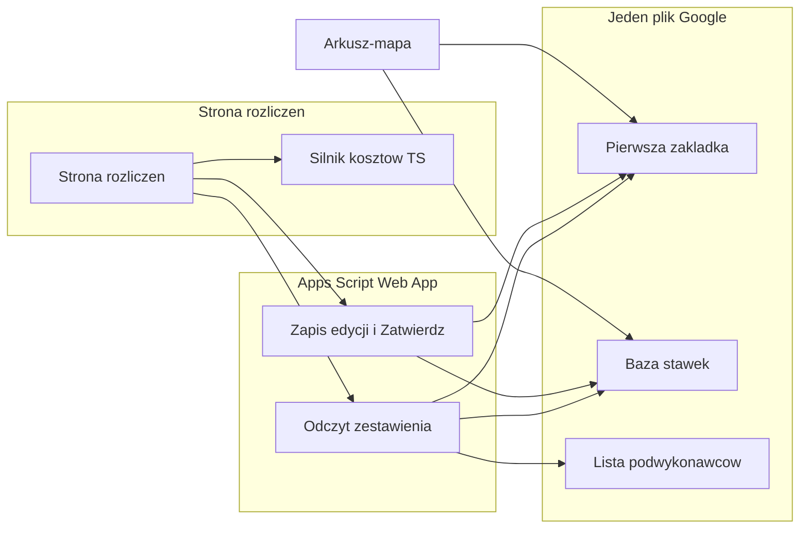

# ARCHITECTURE.md — Rozliczenia

> **Status:** Zatwierdzone 2026-09-19. Kolejność prac jest w [`PLAN.md`](PLAN.md).  
> **Ostatnia aktualizacja:** 2026-09-19  
> **Na podstawie:** `rozliczenia/docs/SPECIFICATION.md`, makieta `rozliczenia/docs/makiety-tabeli.html`  
> **Wzorzec wdrożenia:** Arkusz-mapa i Druga Mila (strona + Apps Script + ten sam plik Google). Nie Symfony, nie Vue, nie PostgreSQL.

---

## Cel techniczny

Osobna aplikacja, która czyta nierozliczone odbiory z istniejącego rejestru, liczy koszt na ekranie i przy Zatwierdź dopisuje na tych samych wierszach status, numer faktury i kwoty. Drugiej kopii odbioru nie ma. Nowej bazy nie ma.

Jednocześnie Arkusz-mapa musi umieć zapisać trasę przy protokole i te same stawki podjazdu i worka. Obie strony piszą do jednego pliku: `1hvSvy9c069SefhYH3rCUDtCViRhAoRQ6DDj_EIlmWNk`.

---

## Propozycja stosu

Specyfikacja mówi wprost, że z zachowania nie wynika Symfony, Vue ani PostgreSQL. Dane już leżą w Google Sheets. Sąsiednie aplikacje (Arkusz-mapa, Druga Mila) są stroną statyczną plus Apps Script.

| Warstwa | Propozycja | Rola |
|---------|------------|------|
| Źródło danych | Istniejący plik Google | Rejestr (pierwsza zakładka), Baza stawek, Lista podwykonawców |
| Zapis i odczyt | Rozszerzenie istniejącego Web App (`arkusz-mapa/google-apps-script/transport-log.gs`) | Lock, odczyt zestawienia, zapis edycji i zatwierdzenia. Nagłówki rejestru tylko przy dopisaniu protokołu. Nagłówki Bazy stawek przy pierwszym zapisie stawki |
| Reguły kosztów | TypeScript, czyste funkcje, Vitest | Liczenie na ekranie. Te same funkcje da się odpalić w teście bez arkusza |
| Ekran | Jedna strona HTML, style z makiety | Dwa ekrany: Zakres i Zestawienie. Okno Baza stawek, nie trzeci ekran |
| Hosting | Własne repozytorium, GitHub Pages z `gh-pages` | Sekret `TRANSPORT_WEBAPP_URL` wchodzi do `index.html` w workflow. Nie ścieżka w Pages mapy |

Vue i Symfony odpadają na tę wersję: nie ma encji do trzymania, a stawka podjazdu i worka zmieniona na zestawieniu **nie** idzie do bazy stawek. Kwota ostateczna powstaje dopiero przy Zatwierdź, z tego, co widać na ekranie. Osobna baza rozjechałaby się z arkuszem.

Decyzja jest w [Zatwierdzenie](#zatwierdzenie).

---

## Architektura

Podział odpowiedzialności:

- **Przeglądarka** liczy koszt, grupuje trasy, trzyma stan ekranu, który nie ma kolumny: „tylko za liczbę worków”, przekreślenie „transport się nie odbył” przed zatwierdzeniem, podgląd stawki podjazdu i worka innej niż w bazie.
- **Apps Script** jest jedynym miejscem zapisu. Nie liczy kosztu na nowo z bazy, bo część kwot żyje tylko na ekranie do Zatwierdź. Zapisuje to, co ekran już policzył, po sprawdzeniu, że wiersz wolno ruszyć.
- **Arkusz** jest stanem trwałym. Po Zatwierdź kolumny 16 i 17 się nie przeliczają.

---

## Gdzie leży kod

`arkusz-mapa` jest osobnym repozytorium git. Katalog `rozliczenia/` leży obok niego, nie w środku. Workflow `arkusz-mapa/.github/workflows/arkusz-mapa-pages.yml` bierze `publish_dir: ./site` i zastępuje całą witrynę. Wrzucenie rozliczeń do tej publikacji zniknie przy następnym generate albo w ogóle się nie zbuduje, bo workflow nie widzi katalogu obok repozytorium.

| Kod | Dom | Jak trafia na stronę |
|-----|-----|----------------------|
| Nazwa trasy | `arkusz-mapa/src/routeName.ts` | Jedna funkcja, testy Vitest. Do HTML wchodzi tak jak `referenceFormatsBrowserScript`: string wstrzyknięty w `phase6.ts`, bez drugiej kopii reguł |
| Zapis arkusza | `arkusz-mapa/google-apps-script/transport-log.gs` | Nowe wdrożenie Web App. URL zostaje ten sam. Sam zapis pliku w repo nic nie zmienia na żywej mapie |
| Silnik kosztów | `rozliczenia/src/` | TypeScript, Vitest. Strona rozliczeń buduje się lokalnie do jednego HTML. Własny `package.json` (typescript, vitest) powstaje przy starcie silnika, nie wcześniej |
| Szablon Word | `arkusz-mapa/docs/pusty.docx` | Bez zmian. Okno protokołu dostaje pola trasy. Dokument Word ich nie dostaje |

Strona rozliczeń ma własne repozytorium. Workflow `rozliczenia-pages.yml` czyta sekret `TRANSPORT_WEBAPP_URL`, wpisuje go do `index.html` i publikuje `gh-pages`. Katalog nie wchodzi do `site/` mapy.

---

## Dane

Nowej tabeli nie zakładamy. Kontrakt jest w specyfikacji: kolumny rejestru po numerze, nie po nagłówku. Baza stawek i Lista podwykonawców po nazwie zakładki.

### Rejestr — pierwsza zakładka

Kolumny 1–11 już zapisuje mapa. Kolumny 12–18 dopisuje się na końcu. Nagłówki w wierszu 1, gdy komórka pusta, wpisuje makro mapy, zanim pierwszy raz dopisze jakikolwiek wiersz protokołu, także bez trasy. W tym samym kroku, raz, lista `tak` / `nie` na kolumnie 18 i przekreślenie wiersza z `nie`. Aplikacja rozliczeń tych nagłówków nie wpisuje, także przy pierwszym odczycie. Brak nagłówka nie zmienia numeru kolumny. Dopóki po wdrożeniu nie zapisze się żadnego nowego protokołu, kolumny 18 nie ma. Brak kolumny znaczy to samo co pusta: transport się odbył.

| # | Pole | Kto pisze | Kiedy |
|---|------|-----------|-------|
| 9 | Ilość worków | Mapa przy protokole; aplikacja przy edycji na zestawieniu | Od razu. Nie czeka na Zatwierdź |
| 12 | Trasa | Mapa przy protokole; aplikacja przy odpięciu i przy nowej trasie | Od razu |
| 13 | Stawka za trasę | Mapa i aplikacja | Od razu, na wszystkich nierozliczonych wierszach z tym samym tekstem nazwy |
| 14 | Rozliczony | Aplikacja | Tylko Zatwierdź: `tak` |
| 15 | Numer faktury | Aplikacja | Tylko Zatwierdź, tylko zaznaczone odbyty transporty |
| 16 | Koszt odbioru | Aplikacja | Tylko Zatwierdź |
| 17 | Koszt odbioru per worek | Aplikacja | Tylko Zatwierdź, razem z 16 |
| 18 | transport się odbył | Arkusz ręcznie albo aplikacja | `nie` przy Zatwierdź wiersza, który sklep obejmuje. Inna wartość niż `nie` = odbył się |

Wiersz z kolumną 14 = `tak` albo kolumną 18 = `nie` nie wraca do wyszukiwania.

Data w kolumnie 5 jest tekstem `dd.mm.yyyy`, tak jak zapisuje ją dziś mapa. Silnik i wyszukanie parsują ten tekst. Nie zakładają ISO.

Klucz zapisu wiersza to numer wiersza arkusza (od 1, nagłówek jest w 1, dane od 2) plus numer z kolumny 1. Odczyt zwraca oba. Zapis pod lockiem odmawia, gdy w tym wierszu kolumna 1 nie jest już tym numerem. Sam numer transportowy nie wystarcza: da się go wpisać ręcznie, więc nie musi być jeden. Sam numer wiersza nie wystarcza: wstawienie wiersza w środek go przesuwa.

### Baza stawek

Zakładka po nazwie. Gdy jej nie ma, zakłada ją pierwszy zapis: mapa albo aplikacja. Kolumny: Sklep (adres), Podwykonawca (nazwa krótka), Kwota za podjazd, Kwota za worek, Od kiedy obowiązuje. Data w tej ostatniej kolumnie to tekst `dd.mm.yyyy`, ten sam zapis co data odbioru w rejestrze. Pusta = od zawsze. Porównanie jest po dacie kalendarzowej, nie po sortowaniu tekstu.

Klucz odczytu: adres + nazwa krótka + data odbioru, nie dzień rozliczenia. Pusta data = od zawsze i jest starsza niż każda wpisana. Obowiązuje najpóźniejsza data nie późniejsza niż odbiór. Dwa wiersze z tą samą parą i tą samą datą to remis: kosztu nie ma, dopóki użytkownik nie wskaże wiersza. Wskazanie zostawia jeden wiersz i usuwa pozostałe z tym kluczem. To jedyne usuwanie stawki w tej wersji.

Stawki trasy w tej zakładce nie ma.

### Czego arkusz nie pamięta

Te rzeczy są tylko na ekranie, aż do Zatwierdź. Payload zatwierdzenia musi je nieść, bo z samego arkusza nie da się ich odtworzyć:

- opcja „tylko za liczbę worków”,
- znacznik „transport się nie odbył” ustawiony na zestawieniu, zanim w kolumnie 18 stoi `nie`,
- kwota za podjazd i kwota za worek zmienione na wierszu, inne niż w Bazie stawek.

---

## Silnik kosztów

Czyste funkcje, bez arkusza i bez DOM. Testy biorą przykłady ze specyfikacji, nie wymyślone liczby.

Wejście: wiersze rejestru w zakresie, wiersze stawek, stan ekranu (worki-only, nie odbył się, nadpisane stawki).  
Wyjście: wiersze tabeli (zwykły albo trasa), kwoty, sumy, lista błędów remisu.

Reguły, których test nie może pominąć:

- Podjazd i trasa wykluczają się. Trzy składniki naraz nie występują.
- Brak stawki, pusta albo 0 za worek, brak pary: 0 zł, bez błędu i bez blokady zatwierdzenia. Remis to błąd, nie 0 zł.
- Udział trasy = stawka / liczba sklepów, które się odbyły, w tym zestawieniu, u tego podwykonawcy. Zaokrąglenie matematyczne do dwóch miejsc. Reszta grosza przepada. Pusta albo zerowa stawka: udział 0. Zero sklepów, które się odbyły: kosztu trasy nie ma, nie dzielimy przez 1.
- Zapis stawki trasy idzie po samym tekście nazwy, na nierozliczone wiersze, bez filtra podwykonawcy i dat. Dzielnik jest węższy.
- Kolumny 16 i 17 powstają przy Zatwierdź i potem się nie zmieniają.

---

## API Web App

Nowe akcje obok istniejących (`modalData`, `listReferenceData`, zapis protokołu). Zapis pod `LockService`, tak jak dzisiejszy POST protokołu. Treść `text/plain`, jak teraz.

| Akcja | Kierunek | Co robi |
|-------|----------|---------|
| `settlementSearch` | GET lub POST | Podwykonawca (nazwa krótka), data od (albo brak), data do. Zwraca wiersze rejestru w zakresie, które nie mają Rozliczony `tak` i nie mają transport `nie`, plus pasujące wiersze Bazy stawek. Każdy wiersz rejestru niesie numer wiersza arkusza i numer z kolumny 1 |
| `listContractors` | GET | Lista podwykonawców: Nazwa i Dane do Worda. Można oprzeć na `listReferenceData`, jeśli pola już tam są |
| `listStoreAddresses` | GET | Unikalne adresy z kolumny Adres sklepu rejestru. Okno stawek. Nie pinezki, nie kolumna Sklep. Nic nie zapisuje |
| `routeNameProposal` | GET | Mapa. Czyta kolumnę 12 i zwraca zajęte nazwy. Propozycję `nazwa-dd.mm.rr-nn` liczy `routeName.ts`, nie skrypt. Gdy 01–99 są zajęte, funkcja zwraca pustą nazwę |
| `routeRateByName` | GET | Mapa i aplikacja. Po tekście nazwy zwraca stawkę z nierozliczonego wiersza. Pusta, gdy nazwy nie było |
| `patchBags` | POST | Jedna komórka: Ilość worków wskazanego wiersza |
| `patchRouteRate` | POST | Nowa stawka na wszystkich nierozliczonych wierszach z tym tekstem w Trasa. Pomija rozliczone. Nie rusza kolumn 16 i 17 |
| `detachRoute` | POST | Czyści Trasa i Stawka za trasę jednego wiersza. Kolumny 16 i 17 zostają puste |
| `attachRoute` | POST | Wpisuje nową nazwę i stawkę na odpiętym wierszu. Pusta stawka nie zapisuje. Kwota 0 zapisuje. Potem ta sama reguła co `patchRouteRate` |
| `saveRate` | POST | Baza stawek. Jeden wiersz klucza: nadpisanie kwot. Więcej niż jeden: odmowa, remis. Inna data: nowy wiersz. Zakłada zakładkę, gdy jej nie ma |
| `resolveRateTie` | POST | Zostawia wskazany wiersz, usuwa pozostałe z tą samą parą i datą |
| `approve` | POST | Patrz niżej |

`approve` przyjmuje numer faktury, listę wierszy zaznaczonych i stan ekranu tych wierszy (koszt już policzony, worki-only, nie odbył się). Skrypt:

1. Odmawia, gdy brak numeru albo brak zaznaczenia.
2. Odmawia wiersza z nierozstrzygniętym remisem. Pozostałe zaznaczone może zapisać.
3. Dla sklepu oznaczonego, że transport się nie odbył: samo `nie` w kolumnie 18. Bez `tak`, bez faktury, bez kolumn 16 i 17.
4. Dla odbytych: `tak`, numer faktury, kolumna 16, kolumna 17 (`koszt / ilość worków`, przy pustej ilości albo 0 dzieli przez 1).
5. Wiersz trasy rozpisuje na sklepy z rozwinięcia, nie na jeden rekord.
6. Nie rusza wierszy spoza zaznaczenia. U nich `nie` też się nie zapisuje.
7. Nie rusza wiersza, który w międzyczasie dostał `tak`.

Odczyt nie wybiera kolumny po nagłówku. Zapis nie przesuwa kolumn 1–11. Każdy zapis wiersza rejestru niesie numer wiersza i numer z kolumny 1 i odpada, gdy para się nie zgadza.

---

## Frontend

Układ, kolory i typografia z `makiety-tabeli.html`. Pasek przełączników na górze makiety (podgląd ekranów) do aplikacji nie wchodzi. Wykresu nie ma.

Dwa ekrany:

1. **Zakres.** Karta na środku. Na zgłoszenie zaznaczone. Harmonogram widać i jest wyłączony. Podwykonawca z listy, zawężanie po Nazwa albo Dane do Worda. Tekstu spoza listy nie da się wybrać. Data początkowa, opcja bez daty początkowej, data końcowa wymagana. Szukaj nie startuje bez podwykonawcy, bez daty końcowej, ani gdy data początkowa jest późniejsza niż końcowa. Baza stawek na dole karty otwiera okno.
2. **Zestawienie.** Po Szukaj. Zmień zakres wraca do karty. Liczba pozycji bez sklepów z rozwinięcia. Tabela. Stopka: Suma zestawienia, Suma zaznaczonych, numer faktury, Zatwierdź.

Kolumny od lewej: Rozliczone, Numer protokołu, Adres, Sklep, Data, Podjazd/Trasa, Liczba worków, Kwota za worek, Suma za worki, Koszt odbioru, Suma trasy, transport się odbył. Pusta komórka pokazuje „—”. Remis stawek widać na wierszu z błędem, nie w oknie Baza stawek. Wskazanie woła `resolveRateTie`.

Ładowanie (wyszukanie, zapis stawek, zatwierdzenie poniżej 10 000 zł): tylko `rozliczenia/logo.png`, puls 1,2 s. Pod spodem krótki komunikat. Od 10 000 zł przy Zatwierdź: `rozliczenia/jednorozec-deba.gif`, cykl 1,7 s, minimum dwa cykle, dłużej jeśli zapis trwa dłużej.

`rozliczenia/logo.png` i `rozliczenia/jednorozec-deba.gif` są w katalogu. `jednorozec-deba.html` to podgląd GIF-a. Cykl GIF-a trwa 1,71 s.

Okno Baza stawek ma te same pola co panel na mapie. Na mapie adres jest z pinezek, podwykonawca z nazw krótkich. W tej aplikacji adres i podwykonawca są listami, bez wpisu ręcznego: adresy z kolumny Adres sklepu rejestru, podwykonawcy z Listy podwykonawców. To nie jest ta sama lista co pinezki mapy.

---

## Granica z Arkusz-mapa

Mapa nie dostaje tabeli rozliczeń ani wykresu. Zbiorczy protokół zostaje jak dziś: osobny wiersz i osobny numer na sklep. Wspólne są tylko nazwa trasy i stawka z jednego okna. Szablon Word się nie zmienia.

| Miejsce | Dziś | Zmiana |
|---------|------|--------|
| `arkusz-mapa/src/routeName.ts` | `proposeRouteName`. Źródło wstrzyknięte w `phase6.ts`, gdy jest okno Word | Propozycja nazwy. Jedna funkcja, testowana. Pamięć sesji nie jest w tej funkcji: żyje w otwartej stronie |
| `arkusz-mapa/src/phase6.ts`, okno `#doc-modal` | Funkcja nazwy jest w skrypcie strony. Pola kończą się na komentarzach | Checkbox „odbiór z trasy”, nazwa, stawka. Bez zaznaczenia pola schowane. POST niesie kolumny 10–11 albo ich nie niesie |
| `transport-log.gs`, `COL` i `appendTransportRow_` | `appendRow` kończy się na komentarzu 2 | Przed dopisaniem wpisuje nagłówki 10–20, jeśli puste. Kolumn 1–9 nie przesuwa. Snapshot podjazdu/worka w 12–13 z Bazy. Komentarze na 19–20. Lista `tak`/`nie` na kolumnie 18. Body z trasą dopisuje 10–11 |
| `arkusz-mapa/docs/TRANSPORT_SHEET.md` | Kolumny 1–11 | Kolumny 1–20 (V2: stawki w rejestrze, komentarze na końcu) |

Mapa nie wpisuje kolumn 14–17, nie woła Zatwierdź i nie rozstrzyga remisu. Nie ostrzega, gdy ta sama nazwa trasy trafia do dwóch podwykonawców.

Kolejność tych zmian jest w [`PLAN.md`](PLAN.md).

---

## Bezpieczeństwo

Dzisiejszy Web App mapy jest wdrożony jako „wykonaj jako ja, dostęp: każdy”. Aplikacja rozliczeń tym samym kanałem zapisze numer faktury i kwoty. To jest największe ryzyko tej wersji.

Na tę wersję nie dokładamy logowania, bo specyfikacja go nie opisuje. Mitygacja minimalna, do decyzji przy zatwierdzeniu:

- Nowe akcje rozliczeń za tym samym sekretem, którego mapa już używa do zapisu, jeśli taki sekret jest. Jeśli go nie ma, powiedzieć to wprost przed W1 w [`PLAN.md`](PLAN.md), nie dopisywać „na wszelki wypadek” pełnego konta użytkownika.
- `approve` i tak sprawdza stan wiersza pod lockiem: nie nadpisuje `tak`, nie zapisuje kolumn 16–17 przy `nie`.
- Kwoty z ekranu zapisujemy, bo tak mówi specyfikacja. Skrypt nie „poprawia” ich z bazy stawek.

Dane w arkuszu to adresy sklepów i nazwy podwykonawców, nie konta osób. RODO: nie kopiujemy rejestru do drugiej bazy.

---

## Ryzyka

| Ryzyko | Prawdopodobieństwo | Wpływ | Mitygacja |
|--------|-------------------|-------|-----------|
| Web App otwarty dla każdego zapisze faktury | Wysokie, jeśli zostawimy „każdy” | Wysoki | Przed W1 ustalić, czy jest sekret zapisu. Bez tego nie wdrażać `approve` na produkcyjny arkusz |
| Mapa dalej liczy ostatni odbiór z wiersza `nie` | Pewne w dzisiejszym skrypcie | Wysoki | M5 jest osobnym etapem, nie czeka na okno protokołu |
| Dwie osoby zatwierdzają ten sam wiersz | Średnie | Wysoki | `LockService` i odmowa, gdy wiersz ma już `tak` |
| Zapis stawki trasy po samym tekście nadpisze innego podwykonawcę | Wysokie, specyfikacja tego chce | Średni | Nie blokować. Test, że tak się dzieje. Nie „naprawiać” przy implementacji |
| Kolumna wstawiona w środek rejestru | Średnie | Wysoki | Zapis sprawdza parę: numer wiersza i kolumna 1. Nie szukać kolumny po nazwie |
| Remis stawek cicho weźmie zły wiersz | Średnie | Wysoki | Odczyt nie wybiera. Zatwierdź tego wiersza stoi |
| Logo i GIF-a nie ma w repo | Zamknięte | Niski | Etap 0: `logo.png` i `jednorozec-deba.gif` są w `rozliczenia/` |
| Logika kosztu w HTML i drugi raz w skrypcie | Średnie | Wysoki | Jedna implementacja w TypeScript. Skrypt zapisuje kwotę z payloadu, nie liczy drugiej |

---

## Zatwierdzenie

Bez tego kod nie startował. Kolejność etapów jest zatwierdzona w [`PLAN.md`](PLAN.md).

- [x] Stos: strona HTML + TypeScript (Vitest) + rozszerzenie istniejącego Apps Script. Bez Symfony, Vue i PostgreSQL w tej wersji
- [x] Hosting: własne repozytorium, Pages z `gh-pages`. Adres Web App z sekretu przy buildzie. Nie wchodzi do workflow Pages mapy
- [x] Klucz zapisu: numer wiersza arkusza plus numer z kolumny 1. Zapis odpada, gdy para się nie zgadza
- [x] Kanał zapisu: ten sam Web App co mapa. Przed W1 (`approve` na żywym arkuszu) wiadomo, czy jest sekret, czy dostęp zostaje „każdy”
- [x] Okno stawek w aplikacji: sposób wyboru adresu i podwykonawcy. Listy (adres z rejestru, nazwa krótka z Listy podwykonawców), bez wpisu ręcznego. Na mapie zostają pinezki — to osobna lista

**Zatwierdzający:** zotrek  
**Data:** 2026-09-19
