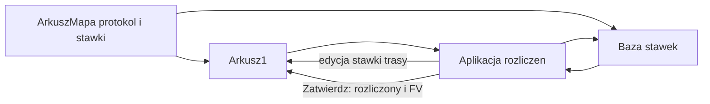

# SPECIFICATION.md — Rozliczanie kosztów odbiorów

> **Status:** Faza 1 — specyfikacja biznesowa  
> **Ostatnia aktualizacja:** 2026-09-23  
> **Właściciel:** Zespół Zwrotka  
> **Źródło:** Wytyczne „Aplikacja do rozliczania kosztów odbiorów” + doprecyzowanie względem rejestru transportów Arkusz-mapa + makiety `rozliczenia/docs/makiety-tabeli.html` i `rozliczenia/docs/makiety-statystyki.html`

---

## Cel Biznesowy

**Co chcemy osiągnąć?**

Osobna aplikacja do rozliczania kosztów odbiorów realizowanych przez podwykonawców i do przypisania tych kosztów do faktury. To nowa aplikacja, nie widok mapy: główna praca odbywa się na tabeli. Są **trzy widoki**: Zakres, Zestawienie (po Szukaj) oraz **Statystyki** (raport odczytowy). Baza stawek to okno, nie osobny ekran. Na Zestawieniu wykresów nie ma. Na Statystykach są proste słupki CSS (bez bibliotek wykresów).

Aplikacja nie służy do wpisywania odbiorów. Dane odbioru powstają przy generowaniu protokołu w Arkusz-mapa i leżą na zakładce **Arkusz1**. Tutaj użytkownik wyszukuje nierozliczone pozycje, widzi składniki kosztu, może zmienić stawki i zatwierdza rozliczenie — albo otwiera Statystyki, żeby zobaczyć KPI i rankingi bez zatwierdzania.

**Dlaczego to robimy?**

Koszt podjazdu, worków i trasy ma być liczony z danych już zapisanych przy protokole (w tym snapshot stawek podjazdu i worka w rejestrze). Bez przepisywania sklepu, daty, worków i numeru protokołu do drugiego miejsca.

---

## Użytkownicy

| Persona | Rola | Potrzeby | Przykład |
|---------|------|----------|----------|
| Osoba generująca protokół | Arkusz-mapa | Oznaczyć, że odbiór jest z trasy, podać nazwę trasy i stawkę | Zaznacza „odbiór z trasy”, zostawia ostatnią nazwę albo wpisuje inną, pobiera Word |
| Osoba utrzymująca stawki | Arkusz-mapa albo aplikacja rozliczeń | Dodać lub zmienić stawkę podjazdu i worka dla sklepu i podwykonawcy | Zapisuje kwoty do bazy stawek z mapy albo z aplikacji rozliczeń |
| Osoba rozliczająca | Aplikacja rozliczeń | Zebrać nierozliczone odbiory podwykonawcy, w razie potrzeby poprawić stawkę i przypisać jeden numer faktury; albo przejrzeć Statystyki | Wybiera podwykonawcę i datę końcową, zaznacza wiersze, klika Zatwierdź; albo otwiera Statystyki z Zakresu |

---

## Zakres tej wersji

Dwa obszary aplikacji docelowo:

1. **Na zgłoszenie** — ta specyfikacja (Zakres, Zestawienie, Statystyki, Baza stawek).
2. **Harmonogram** — MVP: checkbox wybieralny; Szukaj buduje zestawienie z dni podjazdu (`Baza cen harmonogram` + worki z `odebrane z harmonogramu`, także 0 worków). Zatwierdź / faktura w tej wersji niedostępne. Wspólny plik Google (ewidencja), bez drugiej mili.
3. **Baza stawek** — wprowadzanie i edycja kwoty za podjazd i za worek. Robi to Arkusz-mapa i aplikacja rozliczeń, ta sama zakładka. Osobno: **Baza cen harmonogram** (to samo okno, druga zakładka; + dni transportu).

Poza zakresem, świadomie:

- Cofanie rozliczenia i edycja numeru faktury po zatwierdzeniu. W tej wersji tego nie ma.
- Zatwierdzenie faktury w trybie Harmonogram (MVP tylko podgląd kosztów).
- Biblioteki wykresów (Chart.js itd.) i wykres składu kosztów na Zestawieniu. Na Statystykach dozwolone są proste słupki CSS.
- Raport po numerze faktury; lista sklepów bez odbiorów (np. 2 tygodnie); prognoza / trend na przyszłe tygodnie.
- Wybór technologii aplikacji rozliczeń. Z zachowania nie wynika Symfony, Vue ani PostgreSQL.

---

## Reguły kosztów

Koszt pozycji składa się ze składników liczonych osobno: **podjazd**, **worki**, **trasa**.

**Podjazd i trasa wykluczają się.**

- Odbiór zwykły (bez trasy): podjazd i worki. Stawki trasy nie ma.
- Odbiór z trasy: stawka trasy raz na całą trasę i worki. Podjazdu nie ma.
- Tylko worki: sama opłata za worki. Bez podjazdu. Dotyczy odbioru bez trasy, gdy włączona jest opcja tylko za liczbę worków. Odbiór z nazwą trasy zawsze ma stawkę trasy. Tej opcji przy trasie nie ma.

Worki są w każdym z tych przypadków. Nie wyłącza się ich ręcznie. Opłata za worki jest naliczana tylko wtedy, gdy na dzień odbioru obowiązuje stawka za worek, która nie jest pusta ani równa 0. W pozostałych przypadkach opłata za worki wynosi 0 zł, bez ostrzeżenia i bez blokady zatwierdzenia.

Reguła z pierwotnych wytycznych, że jedna pozycja może mieć naraz podjazd, worki i trasę, **nie obowiązuje**.

### Podjazd

Tylko odbiór zwykły. Raz na sklep, według **Stawka za podjazd** z rejestru (snapshot z Bazy stawek przy protokole).

Dziesięć sklepów tego podwykonawcy to do dziesięciu podjazdów, każdy według stawki tego sklepu.

Gdy snapshot jest pusty (brak pary w Bazie w dniu protokołu albo remis), koszt podjazdu wynosi 0 zł, tak samo jak opłata za worki. To nie jest błąd. Bez ostrzeżenia i bez blokady zatwierdzenia.

### Worki

Opłata za worki jest naliczana tylko wtedy, gdy **Stawka za worek** w rejestrze nie jest pusta i nie jest równa 0. Wtedy kwota to `Ilość worków × stawka za worek`. Snapshot powstaje przy protokole z Bazy stawek — [Baza stawek](#baza-stawek).

Pusta stawka za worek albo stawka równa 0: opłata za worki = 0 zł. To nie jest błąd.

Przy trasie koszty worków sklepów sumują się w kolumnie Suma za worki wiersza trasy. Stawka trasy od tego mnożenia nie zależy.

### Trasa

Raz na całą trasę w bieżącym zestawieniu, nie raz na sklep.

Trasa z dziesięcioma sklepami: jedna stawka trasy, nie dziesięć.

Trasa nie jest numerem protokołu. Sklepy jednej trasy mogą mieć różne numery protokołów albo ten sam. Nazwa trasy grupuje adresy, nie nazwy sklepów.

Sklep to **Adres sklepu**, nie kolumna **Sklep**. Dwa wiersze z tą samą nazwą i innym adresem to dwa sklepy. Stawka za worek i za podjazd jest na parę adres + podwykonawca. Ta sama nazwa sklepu ich nie skleja.

Tej samej trasy nie rozlicza się w dwóch turach. To sposób pracy, nie blokada. System nie ostrzega i nie odmawia drugiego Zatwierdź. Sklep, który nie ma wejść w to zatwierdzenie, albo ma transport się nie odbył, albo jest odpięty od trasy.

Protokół pozwala dołączyć sklep do istniejącej nazwy przy innej dacie odbioru. W jednym zestawieniu ta nazwa i tak jest jednym wierszem, także gdy w zakresie są dwa dni. Gdy zakres obejmuje tylko część sklepów tej nazwy, Zatwierdź dzieli całą stawkę przez sklepy widoczne w tym zestawieniu. Drugie wyszukanie pozostałych i drugie Zatwierdź dzieli tę samą stawkę jeszcze raz, pod drugi numer faktury. Dwa numery faktury mogą każdy dostać pełną stawkę. Tego system nie blokuje.

Transport się nie odbył: sklep zostaje przy nazwie, nie wchodzi w koszt i przy zatwierdzeniu trasy dostaje `nie`. Nie dostaje **Rozliczony** `tak`, numeru faktury, udziału w stawce ani całej stawki trasy. Kolumny 16 i 17 zostają puste. W następnym wyszukaniu go nie ma.

Odepnij od trasy: sklep traci nazwę i stawkę tej trasy. Nie jest rozliczony. Starej stawki nie dostaje ani teraz, ani później. Dalej jest odbiorem za podjazd albo osobną trasą, z nową nazwą i własną stawką. Szczegóły: [Tabela — odbiór z trasy](#tabela--odbiór-z-trasy).

### Koszt odbioru

**Koszt odbioru** to kwota jednego sklepu. Ta sama nazwa jest na ekranie i w kolumnie 16 na Arkusz1. Na ekranie widać ją od razu. W kolumnach 16 i 17 jest pusta do Zatwierdź. Dopiero wtedy koszt jest zaakceptowany i te dwie kolumny dostają kwotę. Po Zatwierdź się nie zmienia.

Koszt odbioru = koszt z kolumny Podjazd/Trasa plus suma za worki tego sklepu. Przy trasie w Podjazd/Trasa sklepu wchodzi udział w stawce, nie cała stawka.

Suma za worki to iloczyn liczby worków i kwoty za worek.

- Zwykły odbiór: w Podjazd/Trasa jest podjazd. Koszt odbioru = podjazd + suma za worki.
- Trasa: udział = `stawka za trasę / liczba sklepów`, zaokrąglony matematycznie do dwóch miejsc po przecinku. Cyfra 5 i wyższa w górę. Każdy sklep liczy się osobno. Reszta grosza nie jest dopisywana do żadnego sklepu. Koszt odbioru sklepu = ten udział + suma za worki tego sklepu.
- Tylko worki: w Podjazd/Trasa jest „—”. Koszt odbioru = suma za worki. Wygląd wiersza jest taki sam jak przy odbiorze za podjazd. To nie jest trasa.

**Suma trasy** jest tylko na ekranie, na zgrupowanym wierszu trasy. To stawka trasy raz plus suma za worki wszystkich sklepów tej trasy. Nie jest kolumną Arkusz1. Przy zatwierdzeniu żaden sklep nie dostaje całej sumy trasy, tylko swój Koszt odbioru.

Przykład zwykły: podjazd 20 zł + worki 10 zł = Koszt odbioru 30 zł.  
Przykład trasy na ekranie: worki 40 zł + trasa 150 zł = Suma trasy 190 zł. Dwa sklepy: Koszt odbioru każdego to 75 zł plus worki tego sklepu.  
Przykład zaokrąglenia: stawka 100 zł, trzy sklepy. 100 / 3 = 33,333… → 33,33 zł. Suma udziałów to 99,99 zł.  
Przykład tylko worki: worki 10 zł = Koszt odbioru 10 zł.

---

## Dane

Wszystkie dane są w **istniejącym** pliku Google, w którym leży Arkusz1. Nowego pliku nie zakładamy. Jedyna nowa zakładka to **Baza stawek**. Zakładki Odbiory nie ma: brakujące pola rozliczenia dopisujemy do Arkusz1.

To ten sam dokument Google: `1hvSvy9c069SefhYH3rCUDtCViRhAoRQ6DDj_EIlmWNk` (`GOOGLE_TRANSPORT_SHEETS_ID`, opis w [arkusz-mapa/docs/TRANSPORT_SHEET.md](../../arkusz-mapa/docs/TRANSPORT_SHEET.md)).

Rejestr transportów to zakładka **`Arkusz1`**. Makro szuka jej **po nazwie** (nie po kolejności kart) — tak opisuje to [TRANSPORT_SHEET.md](../../arkusz-mapa/docs/TRANSPORT_SHEET.md). Przestawienie kart w pliku nie psuje zapisu protokołu ani odczytu ostatniego transportu. Zmiana nazwy zakładki rejestru wymaga update skryptu (`REGISTER_SHEET_NAME`).

Słowniki (**Lista podwykonawców**, **Popraw adres**, **Baza stawek**) też są po nazwie.

Kolumny rejestru są po **kolejności**, nie po nazwie nagłówka. Numer kolumny jest umową zapisu i odczytu, w makrze i w aplikacji rozliczeń. Nagłówek w wierszu 1 jest dla człowieka: ma stać w tej samej kolumnie i tym samym tekstem. Wstawienie albo zamiana kolumny w środku zmienia znaczenie danych. Nowe pole dopisuje się zwykle na końcu — wyjątek: jednorazowa migracja V2 (komentarze na 19–20, stawki podjazdu/worka w 12–13) w [TRANSPORT_SHEET.md](../../arkusz-mapa/docs/TRANSPORT_SHEET.md).

Właścicielem wiersza nagłówków rejestru jest makro mapy, to samo, które dopisuje protokół. Zanim pierwszy raz dopisze jakikolwiek wiersz protokołu, także gdy to nie jest odbiór z trasy, wpisuje nagłówki kolumn 10–20 w wierszu 1, jeśli te komórki są puste. W tym samym kroku, raz, zakłada na kolumnie 18 listę `tak` / `nie` i przekreślenie wiersza z `nie`. Kolumn 1–9 nie rusza i nie przesuwa. Brak nagłówka nie jest powodem, żeby pominąć zapis albo wybrać inną kolumnę. Aplikacja rozliczeń tych nagłówków nie wpisuje. Pisze w te same numery. Nie szuka kolumny po nazwie i nie zakłada drugiej kopii rejestru. Dopóki po tym wdrożeniu nie zapisze się żadnego nowego protokołu, kolumny 18 nie ma. Brak kolumny znaczy to samo co pusta: transport się odbył.

| Jak się znajduje | Zakładka | Rola |
|------------------|----------|------|
| Po nazwie | Arkusz1 | Protokoły i rozliczenie. Jeden wiersz = jeden odbiór w sklepie |
| Po nazwie | Baza stawek | Stawki podjazdu i worka. Nic więcej |

Brak zakładki o nazwie **Baza stawek** nie kończy się cichym brakiem zapisu. Zakładkę i wiersz nagłówków zakłada ten zapis, który jest pierwszy: mapa albo aplikacja rozliczeń. Druga strona używa już istniejącej. Nie wybiera innej zakładki „bo jest pierwsza” i nie zakłada drugiej o tej samej roli.

### Arkusz1

To jest „arkusz podsumowania tras” z wytycznych. Mechanizm już istnieje: przy protokole dopisywany jest wiersz na sklep. Rozliczenie czyta te same wiersze i dopisuje na nich status oraz numer faktury. Drugiej kopii odbioru nie ma.

Kolejność kolumn rejestru. Numery 1–9 są już w makrze. Po migracji V2:

1. Numer transportowy
2. Adres sklepu
3. Podmiot handlowy
4. Sklep
5. Data odbioru
6. Kto odbiera
7. Miejsce zrzutu
8. Rodzaj zbiórki
9. Ilość worków
10. **Trasa** — nazwa lub numer trasy. Pusta, gdy to nie jest odbiór z trasy, także po odpięciu od trasy. Nie zastępuje numeru transportowego.
11. **Stawka za trasę** — jedna kwota dla całej nazwy trasy. Pusta, gdy to nie jest odbiór z trasy. W bazie stawek tej kwoty nie ma. Zmiana przy protokole i edycja na zestawieniu rozliczeń nadpisują **Stawka za trasę** na wszystkich nierozliczonych wierszach z tą samą nazwą w **Trasa**. Kluczem zapisu jest sam tekst nazwy. Zapis nie patrzy na **Kto odbiera** i nie patrzy na zakres dat. Dzielnik przy rozliczeniu patrzy: liczy tylko sklepy tego podwykonawcy w bieżącym zestawieniu. Własna nazwa, nie ze schematu, może więc nadpisać stawkę innego podwykonawcy z tym samym tekstem w **Trasa**. Zmiana na zestawieniu z jednego dnia nadpisuje też sklepy tej nazwy z innego dnia, choć ich na ekranie nie ma i to Zatwierdź ich nie oznacza. System nie ostrzega i nie blokuje. Wiersze już rozliczone są pominięte. Ten zapis jest od razu. Kolumn 16 i 17 nie rusza. Szczegóły: [Tabela — odbiór z trasy](#tabela--odbiór-z-trasy).
12. **Stawka za podjazd** — snapshot z Bazy stawek przy dopisaniu wiersza protokołu (adres + kto odbiera + data odbioru). Remis albo brak pary → puste. Aplikacja rozliczeń liczy koszt z tej kolumny, nie z Bazy na żywo. Nadpisanie na ekranie zestawienia nie wraca tu ani do Bazy.
13. **Stawka za worek** — j.w. snapshot przy protokole.
14. **Rozliczony** — puste do momentu Zatwierdź. Po zatwierdzeniu `tak`. Wpisuje aplikacja rozliczeń, nie mapa. Wiersz z `tak` jest rozliczony i nie wraca do wyszukiwania. Inna wartość niż `tak`, także pusta, znaczy, że nie jest rozliczony.
15. **Numer faktury** — pusty do zatwierdzenia. Potem jeden numer, tylko na transportach rozliczonych na tym ekranie. Wiersze pokazane, ale niezaznaczone, oraz transporty spoza tego ekranu numeru nie dostają. Wpisuje aplikacja rozliczeń.
16. **Koszt odbioru** — kwota tego sklepu. Wzór: [Koszt odbioru](#koszt-odbioru). Pusta do Zatwierdź. Wpisuje ją aplikacja rozliczeń dopiero wtedy, razem z **Rozliczony** `tak`. Po Zatwierdź się nie zmienia.
17. **Koszt odbioru per worek** — w tym samym zapisie co kolumna 16, nie wcześniej. `Koszt odbioru / Ilość worków`. Gdy Ilość worków jest pusta albo równa 0, dzielimy przez 1.
18. **transport się odbył** — lista rozwijana: `tak` albo `nie`. Da się wybrać w arkuszu, także przy edycji w Excelu. Pusta albo `tak` znaczy, że transport się odbył. Wartość `nie` znaczy, że się nie odbył. Taki wiersz nie dostaje **Rozliczony** `tak`, numeru faktury ani kolumn 16 i 17. Nie wchodzi w udział w trasie ani w całą stawkę trasy. Nie wraca do wyszukiwania. Przy zatwierdzeniu wiersza, który go obejmuje, aplikacja rozliczeń wpisuje samo `nie`. Inna wartość niż `nie` też znaczy, że transport się odbył.
19. **Komentarz 1** — tylko rejestr / protokół mapy. Rozliczenia nie czytają.
20. **Komentarz 2** — j.w.

Gdy **transport się odbył** ma wartość `nie`, także wpisaną w arkuszu przed otwarciem rozliczenia, wiersz nie wchodzi do wyszukiwania. Na Arkusz1 jest przekreślony. W aplikacji rozliczeń go nie ma. Arkusz-mapa traktuje worki tego wiersza jako nieodebrane. Data tego wiersza nie odcina worków tak, jak data transportu, który się odbył. W pozostałych miejscach wiersz jest transportem, który się nie odbył. Nie wchodzi w koszt: bez podjazdu, bez worków i bez udziału w trasie. Przy trasie ten sklep nie wchodzi w liczbę sklepów ani w sumę worków. Gdy żaden sklep trasy się nie odbył, kosztu trasy nie ma.

Inna wartość niż `nie` nie przekreśla wiersza i nie wyłącza kosztu.

Liczba sklepów to liczba sklepów tej nazwy i tego „Kto odbiera” w bieżącym zestawieniu, które się odbyły. Sklepy tej nazwy poza zakresem dat nie wchodzą w ten dzielnik. Nie odbył się wiersz z **transport się odbył** równym `nie` oraz wiersz oznaczony na zestawieniu, że transport się nie odbył — także zanim `nie` zostanie zapisane. Taki sklep dostaje 0 zł i nie wchodzi w dzielnik. Pusta albo zerowa stawka za trasę daje udział 0 zł. Gdy żaden sklep trasy w tym zestawieniu się nie odbył, kosztu trasy nie ma. Stawki nie dzieli się wtedy przez 1.

Przykład: stawka 150 zł, trzy sklepy, jeden oznaczony na ekranie, że transport się nie odbył. Dzielnik to 2. Udział każdego z dwóch, które się odbyły, to 75 zł. Wyłączony sklep dostaje 0 zł.

Koszt worków jest liczony jak w regułach worków, ze **Stawka za worek** w rejestrze: tylko gdy nie jest pusta ani równa 0. Inaczej 0 zł. Koszt podjazdu bierze się z **Stawka za podjazd** w tym samym wierszu rejestru. Puste snapshoty dają 0 zł za podjazd i 0 zł za worki.

Kolumny 16 i 17 są puste do zatwierdzenia. Aplikacja rozliczeń pokazuje koszt na ekranie z aktualnych stawek i z kwot wpisanych na zestawieniu. Przy **Zatwierdź** wpisuje obie, jako kwotę ostateczną. Dopisanie kolejnego sklepu do trasy i późniejsza zmiana stawek nie przeliczają już kwot zapisanych przy zatwierdzeniu. Edycja stawki za trasę nie rusza wierszy już rozliczonych i nie wpisuje kolumn 16 ani 17.

Rozliczony wiersz nie wraca do wyszukiwania. Wiersz z **transport się odbył** `nie` też nie, nawet gdy **Rozliczony** jest puste.

Zbiorcze generowanie protokołów zostaje jak dziś: osobny wiersz i osobny numer na każdy sklep. Wspólne są tylko nazwa trasy i stawka wpisane w jednym oknie.

### Baza stawek

Nowa zakładka w tym samym pliku, po nazwie **Baza stawek**. Nie ma tu stawki za trasę. Kolumny też są po kolejności. Nagłówki w wierszu 1 wpisuje ten, kto zakłada zakładkę.

| # | Kolumna | Znaczenie |
|---|---------|-----------|
| 1 | Sklep | Adres sklepu. Klucz razem z podwykonawcą i datą. To ta sama wartość co **Adres sklepu** na Arkusz1, nie kolumna **Sklep** z rejestru |
| 2 | Podwykonawca | Nazwa krótka. Klucz razem ze sklepem i datą. To ta sama wartość co **Kto odbiera** na Arkusz1, nie nazwa do protokołu |
| 3 | Kwota za podjazd | Stawka jednego podjazdu w tym sklepie u tego podwykonawcy |
| 4 | Kwota za worek | Stawka jednego worka |
| 5 | Od kiedy obowiązuje | Tekst `dd.mm.yyyy`, ten sam zapis co **Data odbioru** na Arkusz1. Od tej daty wiersz zastępuje starszą stawkę tej pary. Puste = od zawsze. Porównanie jest po dacie kalendarzowej, nie po sortowaniu tekstu |

Ta sama para Sklep + Podwykonawca może mieć kilka wierszy, z różną datą. Sklep w tej parze to adres sklepu. Podwykonawca to nazwa krótka. Inna data to nowy wiersz, nie nadpisanie. Zapis przy jednym wierszu tej daty i remis przy dwóch są niżej.

Który wiersz wchodzi w koszt, liczy się po **Data odbioru** na Arkusz1, nie po dniu rozliczenia. Trzeba trafić w dobry przedział, nie brać „najnowszej stawki w ogóle”.

Każdy wiersz obowiązuje od swojej daty do dnia poprzedzającego następną datę tej samej pary. Pusta data zaczyna przedział od zawsze. Ostatni wiersz nie ma końca.

- Do odbioru pasują tylko wiersze, których data jest pusta albo nie późniejsza niż data odbioru.
- Z pasujących obowiązuje ten z najpóźniejszą datą. Pusta data jest starsza niż każda wpisana.
- Wiersz z datą późniejszą niż odbiór jeszcze nie obowiązuje.
- Gdy żaden wiersz nie pasuje, pary na ten dzień nie ma.

Zapis z tą samą parą i tą samą datą nadpisuje kwoty tylko wtedy, gdy taki wiersz jest jeden. Dwa albo więcej wierszy z tą samą parą i tą samą datą (także obie daty puste) to remis. Odczyt nie wybiera żadnego. To nie jest 0 zł i nie jest „nowsza z góry”.

Remis dotyczy odbioru, gdy data, która miałaby obowiązywać, nie jest jedna. Starszy dublet, który i tak przegrywa z późniejszą datą, odbioru nie blokuje.

Przy rozliczeniu taki odbiór pokazuje błąd stawek. Kosztu z tej pary na ekranie nie ma, dopóki użytkownik nie wskaże wiersza. Wskazanie jest na wierszu z błędem w zestawieniu, nie w oknie Baza stawek. Widać te wiersze: datę, kwotę za podjazd i kwotę za worek. Użytkownik wybiera, który obowiązuje. To nie zależy od tego, jak w oknie stawek wybiera się sklep i podwykonawcę.

Wybór zapisuje się od razu i zostaje. W Bazie stawek zostaje wskazany wiersz. Pozostałe z tą samą parą i tą samą datą są usuwane. To jedyne usuwanie wiersza stawki w tej wersji. Już zapisany Koszt odbioru i Koszt odbioru per worek się nie zmieniają. Koszt jeszcze niezatwierdzony liczy się od nowa ze stawki, która została.

Mapa i aplikacja, gdy trafią na więcej niż jeden wiersz tego klucza przy zapisie do Bazy, nie nadpisują jednego z nich. Remis przy zapisie `saveRate` odmawia. Przy dopisywaniu protokołu remis w Bazie kończy się pustym snapshotem w rejestrze (koszt 0), bez blokady zatwierdzenia.

Przykład dla jednej pary Sklep + Podwykonawca:

| Od kiedy | Stawka |
|----------|--------|
| puste | 100 zł |
| 10.09.2026 | 150 zł |
| 10.10.2026 | 200 zł |

Odbiór przed 10.09.2026 bierze 100 zł. Odbiór od 10.09.2026 do 09.10.2026 bierze 150 zł. Odbiór 10.10.2026 i późniejszy bierze 200 zł. Stawka 150 zł nie zostaje po 10.10.2026.

Dalsze dopisywanie i zmiana kwot odbywa się w Arkusz-mapa oraz w aplikacji rozliczeń. Zasady zapisu są te same: [Arkusz-mapa — baza stawek](#arkusz-mapa--baza-stawek).

---

## Arkusz-mapa — protokół

W oknie generowania dokumentu Word, obok obecnych pól:

- Checkbox **odbiór z trasy**.
- Po zaznaczeniu: **nazwa/numer trasy** i **stawka za trasę**.

Nazwa trasy:

- Domyślnie ostatnia nazwa wpisana w tej sesji korzystania z Arkusz-mapa. To pamięć otwartej strony, nie ostatni wiersz kolumny Trasa i nie zapis na stałe.
- Odświeżenie strony czyści tę pamięć. Po odświeżeniu nie ma „ostatniej nazwy”.
- System tej nazwy nie zwiększa w trakcie sesji. Kolejny protokół w tej samej sesji dostaje ją taką, jaka została zapisana. To jest dołączanie do trasy z tego okna, nie nowa trasa.
- Gdy w sesji nie ma jeszcze żadnej nazwy, system proponuje nową według schematu `nazwaPodwykonawcy-dd.mm.rr-nn`, na przykład `gpw-18.09.26-01`.
- `nazwaPodwykonawcy` to krótka nazwa z pola „Kto odbiera”.
- Data w nazwie to data transportu z protokołu (**Data odbioru**), w formacie `dd.mm.rr`.
- `nn` to dwie cyfry. System sprawdza kolumnę **Trasa** w rejestrze. Dla początku `nazwaPodwykonawcy-dd.mm.rr-` bierze najmniejszy wolny numer, od `01`. Gdy `01` już jest, proponuje `02`, potem `03`. Nowa propozycja nie trafia w istniejącą nazwę, więc protokół nie dołącza do tej trasy i nie nadpisuje jej stawki. Gdy wolnego numeru od `01` do `99` nie ma, propozycji nie ma: pole nazwy zostaje puste, do wpisania.
- Użytkownik może wpisać inną nazwę, także taką, która już jest w arkuszu, i także przy innej dacie odbioru. Wtedy dołącza świadomie. Rozliczenie tego nie blokuje. Po zapisie protokołu ta nazwa staje się ostatnią w sesji, aż do odświeżenia.

Stawka za trasę:

- Po wybraniu nazwy, która już była użyta, pokazuje się stawka zapisana przy tej nazwie.
- Użytkownik może ją zmienić. Nowa kwota dotyczy całej nazwy: przy zapisie protokołu **Stawka za trasę** dostaje ją na tym wierszu i na każdym innym nierozliczonym wierszu Arkusz1 z tą samą nazwą w **Trasa**, bez względu na **Kto odbiera** i na datę odbioru. System nie ostrzega i nie blokuje. Kolumny 16 i 17 się od tego nie zmieniają. Tak samo edycja tej stawki na zestawieniu rozliczeń. Szczegóły: [Tabela — odbiór z trasy](#tabela--odbiór-z-trasy).
- Nazwa nigdy wcześniej nie użyta: pole stawki puste, do wpisania. Pusta stawka i tak zapisuje protokół. W kolumnie zostaje pusta, udział wynosi 0 zł. Kwota 0 też się zapisuje. To nie blokuje Worda. Inaczej jest tylko przy nowej trasie po odpięciu: tam pusta stawka trasy nie zapisuje.

Bez checkboxa oba pola są ukryte. Na Arkusz1 kolumny Trasa i Stawka za trasę zostają puste.

Zapis protokołu dopisuje jeden wiersz na Arkusz1, łącznie z tymi kolumnami. Osobnego wiersza w innej zakładce nie ma. Samo zaznaczenie checkboxa, bez zapisu protokołu, nic nie przenosi.

---

## Arkusz-mapa — baza stawek

Stawki podjazdu i worka użytkownik wprowadza i edytuje na mapie, w tym samym panelu co lista podwykonawców i poprawa adresu („Dodaj do listy / popraw adres”), oraz w aplikacji rozliczeń. Zasady zapisu są wspólne. Stawki trasy tu nie ma. Ta kwota jest przy protokole i da się ją zmienić na zestawieniu rozliczeń.

Pola zapisu:

- Sklep — adres sklepu, jak **Adres sklepu** na Arkusz1. Na mapie wybór z listy rozwijalnej adresów sklepów już obecnych na mapie. Nie wpisuje się go ręcznie.
- Podwykonawca — nazwa krótka, jak **Kto odbiera** na Arkusz1. Na mapie wybór z listy rozwijalnej nazw krótkich z zakładki **Lista podwykonawców**. Nie wpisuje się jej ręcznie.
- Kwota za podjazd
- Kwota za worek
- Od kiedy obowiązuje — tekst `dd.mm.yyyy`, jak **Data odbioru**. Puste znaczy od zawsze

Klucz wiersza to adres sklepu + nazwa krótka podwykonawcy + data obowiązywania. Gdy taki wiersz jest jeden, ta sama trójka nadpisuje kwoty. Gdy jest ich więcej, zapisu w jeden z nich nie ma: remis rozstrzyga użytkownik przy rozliczeniu. Inna data tej samej pary dopisuje kolejny wiersz, na przykład 100 zł teraz i 150 zł od 10.10.2026.

Kwota 0 i puste pole są dozwolone. Przy workach pusta albo zerowa stawka za worek daje 0 zł, tak samo jak brak pary Sklep + Podwykonawca. Brak tej pary przy podjeździe też daje 0 zł za podjazd. To nie jest błąd i nie blokuje zatwierdzenia.

Zapis idzie od razu do arkusza. Nie czeka na przebudowę mapy.

Edycja stawek nie zmienia kolumn Rozliczony, Numer faktury ani kolumn 16 i 17. Te dwie powstają dopiero przy zatwierdzeniu, gdy koszt jest zaakceptowany, i zostają kwotą ostateczną. Do tego momentu aplikacja rozliczeń liczy koszt na ekranie z aktualnej bazy stawek.

Usuwanie wiersza stawki nie jest w tej wersji, poza rozstrzygnięciem remisu: [Baza stawek](#baza-stawek).

---

## Moduł „Na zgłoszenie”

Aplikacja rozliczeń jest nowa i osobna od mapy Arkusz-mapa. Nie pokazuje mapy. Główna praca to tabela pozycji do rozliczenia, filtr, edycja stawek i zatwierdzenie. Osobny widok **Statystyki** jest tylko do odczytu — [Statystyki](#statystyki).

Pola, kolumny, checkboxy i sumy opisane niżej są wymagane. Układ ekranu jest w [Układ ekranu](#układ-ekranu). Na Zestawieniu wykresu składu kosztów nie wolno dodać. Na Statystykach dozwolone są proste słupki CSS (bez Chart.js i podobnych).

Gdy cokolwiek się ładuje — wyszukanie, zapis stawek, zatwierdzenie poniżej 10 000 zł, **odczyt Statystyk** — widać tylko ikonę z `rozliczenia/logo.png`, bez spinnera i bez napisu obok znaku. To paragon z pomarańczowym haczykiem. Nie ma wersji z napisem ani innych znaków. Ikona pulsuje tak jak logo ładowania w Arkusz-mapa: 1,2 s, `ease-in-out`, w kółko. Na początku i na końcu cyklu skala 1 i pełna krycie. W środku skala 1,12 i krycie 0,55. Pod ikoną krótki komunikat, co trwa (np. „Ładuję dane…”). Jednorożec nie zastępuje tego znaku, poza zatwierdzeniem od 10 000 zł.

### Układ ekranu

Układ Zakresu i Zestawienia jest w makiecie `rozliczenia/docs/makiety-tabeli.html`. Układ Statystyk — w `rozliczenia/docs/makiety-statystyki.html`. Pasek przełączników na górze stron makiet nie wchodzi do aplikacji. Kolory, odstępy i typografia biorą się z makiet. Teksty na Statystykach mają być zrozumiałe bez znajomości kolumn arkusza (język zarządu).

Trzy widoki aplikacji + okno Bazy stawek. Tabeli na Zakresie nie ma. Na Zestawieniu wykresu składu kosztów nie ma.

**Zakres.** Na środku karta. Ikona, nazwa Rozliczenia i tryb Na zgłoszenie. Pod spodem dwa tryby: Na zgłoszenie zaznaczony, Harmonogram da się zaznaczyć. Potem podwykonawca, data początkowa, data końcowa i Szukaj. Na dole karty: **Statystyki** (wejście bez Szukaj) oraz **Baza stawek**. Baza stawek otwiera okno (zakładki: Baza stawek / Baza cen harmonogram), nie osobny ekran. Sklep i podwykonawca są listami, bez wpisu ręcznego: adres z kolumny Adres sklepu rejestru, nazwa krótka z Listy podwykonawców. To nie są pinezki mapy.

**Zestawienie.** Po Szukaj. W nagłówku ikona, zakres (podwykonawca i daty) oraz przycisk Zmień zakres, który wraca do ekranu Zakres. Obok jest Baza stawek. Przycisku Statystyki na Zestawieniu nie ma. Pod nagłówkiem liczba pozycji w zestawieniu, bez sklepów z rozwinięcia trasy. Potem tabela. Na dole Suma zestawienia, Suma zaznaczonych, numer faktury i Zatwierdź.

**Statystyki.** Z Zakresu. W nagłówku ikona, nazwa Rozliczenia / Statystyki oraz **← Powrót** (wraca do Zakresu). Filtry okresu i podwykonawcy, potem KPI i sekcje raportów. Szczegóły: [Statystyki](#statystyki).

Opcja **tylko za liczbę worków** stoi pod nazwą sklepu przy odbiorze zwykłym, nie w osobnej kolumnie. Na wierszu trasy jej nie ma.

Kolumny tabeli, od lewej: Rozliczone, Numer protokołu, Adres, Sklep, Data, Podjazd/Trasa, Liczba worków, Kwota za worek, Suma za worki, Koszt odbioru, Suma trasy, transport się odbył. Komórka bez wartości pokazuje „—”. Na odbiorze zwykłym Suma trasy jest „—”. Na wierszu trasy nazwa trasy jest w Adres, a „—” jest w Numer protokołu, Sklep, Koszt odbioru i transport się odbył. Adresy są pogrubione. Nazwy sklepów nie. W Podjazd/Trasa stoi znacznik podjazd albo trasa.

### Edycja stawek

W aplikacji jest opcja dodania i zmiany stawki podjazdu oraz worka. Zapis idzie do tej samej zakładki **Baza stawek** co z mapy. W tym oknie stawki trasy nie ma. Stawkę trasy zmienia się na wierszu trasy w zestawieniu. Zapis idzie od razu do **Stawka za trasę**, nie do Bazy stawek i nie do kolumn 16 ani 17. Szczegóły: [Tabela — odbiór z trasy](#tabela--odbiór-z-trasy).

Pola i zasady zapisu są te same co na mapie: Sklep to adres sklepu, Podwykonawca to nazwa krótka, Kwota za podjazd, Kwota za worek, Od kiedy obowiązuje. Na mapie listy są z pinezek i z nazw krótkich. W tej aplikacji adres jest z kolumny Adres sklepu rejestru, podwykonawca to nazwa krótka z Listy podwykonawców. Wpisu ręcznego nie ma. Ta sama para i ta sama data nadpisują kwoty, gdy taki wiersz jest jeden. Dwa wiersze to remis, nie nadpisanie. Inna data dopisuje nowy wiersz. Kwota 0 i puste pole kwoty są dozwolone. Pusta data obowiązywania znaczy od zawsze. Usuwania wiersza nie ma, poza rozstrzygnięciem remisu.

Zapis stawek podjazdu i worka jest od razu, nie czeka na Zatwierdź. Nie zmienia kolumn Rozliczony, Numer faktury, Koszt odbioru ani Koszt odbioru per worek. Koszt na ekranie, jeszcze niezatwierdzony, liczy się od nowa z aktualnej bazy.

### Filtr

Na początku użytkownik widzi dwa checkboxy:

- **Na zgłoszenie** — na starcie zaznaczony. Wyszukiwanie dotyczy rejestru `Arkusz1`.
- **Harmonogram** — zaznaczalny. Szukaj czyta `Baza cen harmonogram` (dni podjazdu) i `odebrane z harmonogramu` (liczba worków; może być 0). Zatwierdź niedostępne.

Podwykonawcę znajduje się tak samo jak na mapie, z tej samej **Listy podwykonawców**. Kolumny to **Nazwa** i **Dane do Worda**. Nazwa to nazwa krótka, ta sama co **Kto odbiera**. Adresu nie ma w osobnej kolumnie. Jest w **Dane do Worda**, sklejony z nazwą do protokołu, BDO i NIP, tak jak zapisuje go mapa.

Lista zawęża się po fragmencie **Nazwa** albo **Dane do Worda**. Wybór jest z listy. Do rozliczenia wchodzi **Nazwa**, nie treść do Worda. Tekstu, którego nie ma na liście, nie da się użyć jako podwykonawcy. Bez wybranego podwykonawcy wyszukanie nie startuje.

Potem użytkownik podaje:

- datę początkową,
- datę końcową.

Obok daty początkowej jest opcja **bez daty początkowej**. Zaznaczenie czyści datę: wszystkie nierozliczone odbiory tego podwykonawcy aż do daty końcowej włącznie. Zdjęcie opcji przywraca ostatnią wpisaną datę. Obie daty można wpisać albo wybrać z kalendarza.

Data końcowa jest wymagana.

Porównanie jest po **dacie odbioru**. Obie granice są włącznie, także przy dacie początkowej. Odbiór z datą równą początkowej albo równą końcowej wchodzi. Ten sam dzień w obu polach też: to ten jeden dzień.

Data początkowa późniejsza niż końcowa nie startuje wyszukania. Widać błąd: data początkowa nie może być późniejsza niż końcowa. Przy opcji bez daty początkowej tej pary nie ma.

Po wyszukaniu widać tylko odbiory nierozliczone tego podwykonawcy w tym zakresie, bez wierszy z **transport się odbył** `nie`. Rozliczony odbiór nie wraca i nie wchodzi do kalkulacji. Odbiór z `nie` też nie wraca.

### Tabela — odbiór zwykły

Jeden wiersz na jeden odbiór (jeden sklep, jeden numer protokołu). Tak samo wygląda wiersz, gdy rozliczenie jest tylko za worki.

Kolumny, od lewej: Rozliczone, Numer protokołu, Adres, Sklep, Data, Podjazd/Trasa, Liczba worków, Kwota za worek, Suma za worki, Koszt odbioru, Suma trasy, transport się odbył. Na odbiorze zwykłym w Suma trasy jest „—". Adres jest pogrubiony, nazwa sklepu nie. Kolejność jest w [Układ ekranu](#układ-ekranu).

Podjazd i trasa są jedną kolumną **Podjazd/Trasa**, bo w jednym wierszu nigdy nie ma obu kwot naraz. W tej kolumnie jest koszt za podjazd albo „—”, gdy rozliczenie jest tylko za worki.

**Koszt odbioru** na tym ekranie to koszt za podjazd albo „—” plus suma za worki. Suma za worki to iloczyn liczby worków i kwoty za worek. Gdy stawki za worek nie ma, jest pusta albo równa 0, suma za worki wynosi 0 zł.

Liczba worków to **Ilość worków** tego odbioru. Na tym ekranie da się ją zmienić. Nowa liczba zapisuje się od razu do **Ilość worków** tego konkretnego wiersza na zakładce Arkusz1 w pliku `1hvSvy9c069SefhYH3rCUDtCViRhAoRQ6DDj_EIlmWNk`. Nie czeka na Zatwierdź. Suma za worki i Koszt odbioru na ekranie liczą się od nowa. Na Arkusz1 **Koszt odbioru** i **Koszt odbioru per worek** powstają dopiero przy zatwierdzeniu.

Kwota za worek na starcie to stawka obowiązująca w dniu odbioru. Kwotę za podjazd i kwotę za worek też da się tu zmienić. Te zmiany nie zapisują się w Bazie stawek. Inne odbiory tego sklepu dalej biorą stawkę z bazy. Do zatwierdzenia obowiązują tylko na ekranie i wchodzą w Koszt odbioru tego wiersza. Gdy wiersz jest zaznaczony jako rozliczony i użytkownik klika Zatwierdź, ten Koszt odbioru zapisuje się w kolumnie **Koszt odbioru**. **Koszt odbioru per worek** to **Koszt odbioru** podzielony przez **Ilość worków**. Gdy Ilość worków jest pusta albo równa 0, dzielimy przez 1.

### Tabela — odbiór z trasy

**Założenie tej wersji:** jedna nazwa trasy u wybranego podwykonawcy, w podanym zakresie dat, to jeden wiersz, także gdy sklepy mają różne daty odbioru. Zwykle trasa jest w jeden dzień i ten dzień jest na wierszu. Gdy w zestawieniu dzień nie jest jeden, w kolumnie Data jest „—", a daty są przy sklepach po rozwinięciu. Sklepy mogą mieć różne numery protokołów. Na wierszu trasy w kolumnie Numer protokołu jest „—". Trasa jest na zestawieniu tylko wtedy, gdy opłata jest za trasę. Opcji **tylko za liczbę worków** tu nie ma i wiersz trasy nie rozpada się na sklepy.

Na wierszu trasy:

| Kolumna | Wartość |
|---------|---------|
| Adres | Nazwa trasy |
| Sklep | „—" |
| Data | Dzień wspólny sklepów tej trasy w zestawieniu. Gdy dzień nie jest jeden, „—" |
| Podjazd/Trasa | Stawka trasy, raz, do zmiany. Podjazdu nie ma |
| Liczba worków | Suma ilości worków sklepów tej trasy, bez sklepów, w których transport się nie odbył |
| Kwota za worek | Stawka za worek tego adresu. Na wierszu trasy widać ją tylko wtedy, gdy każdy adres trasy, który się odbył, ma tę samą kwotę. Inaczej jest „—" |
| Suma za worki | Suma kosztów worków sklepów tej trasy, bez sklepów, w których transport się nie odbył |
| Suma trasy | Koszt z Podjazd/Trasa plus suma za worki. Stawka trasy raz. Nie zapisuje się jako jedna kwota na Arkusz1 |
| Rozliczone | Jeden checkbox na cały wiersz |

Kolumna Numer protokołu jest w tabeli, ale na wierszu trasy pokazuje „—". Numery protokołów sklepów zostają na Arkusz1 i widać je po rozwinięciu.

Rozwinięcie wiersza pokazuje sklepy tej trasy: numer protokołu, adres, nazwę sklepu, datę, liczbę worków, opcję, że transport się nie odbył, i **odepnij od trasy**. Adres rozróżnia sklep, nie nazwa. Sumy za worki w rozwinięciu nie ma. Kwota za worek jest w rozwinięciu tylko wtedy, gdy adresy nie mają jednej wspólnej kwoty.

Liczbę worków edytuje się przy adresie, nie na zsumowanym wierszu trasy. Zapisuje się od razu do **Ilość worków** wiersza tego adresu. Kwota za worek, gdy jest wspólna, jest na wierszu trasy. Jej zmiana dotyczy na ekranie każdego adresu tej trasy, który się odbył, i nie zapisuje się w Bazie stawek. Gdy kwoty się różnią, zmianę robi się przy adresie i dotyczy tylko jego, też tylko na ekranie. Po zaznaczeniu rozliczenia i Zatwierdź Koszt odbioru tego adresu trafia do kolumny **Koszt odbioru**, a **Koszt odbioru per worek** to **Koszt odbioru** podzielony przez **Ilość worków** (przy pustej ilości albo 0 dzielimy przez 1). Suma trasy po rozwinięciu nadal jest raz. Rozwinięcie nie służy do rozliczania pojedynczego sklepu osobno.

Stawkę trasy edytuje się na zsumowanym wierszu, w Podjazd/Trasa, nie przy sklepie. Zapis jest od razu, nie czeka na Zatwierdź i nie idzie do Bazy stawek.

Nowa kwota nadpisuje **Stawka za trasę** na każdym nierozliczonym wierszu Arkusz1 z tą samą nazwą w **Trasa**, bez względu na **Kto odbiera** i na datę odbioru. Tak samo jak zmiana przy protokole. Dzielnik tego nie powtarza: liczy tylko sklepy wybranego podwykonawcy w tym zestawieniu. System nie ostrzega i nie blokuje. Kolumny 16 i 17 zostają puste. Wiersze już rozliczone są pominięte.

Na ekranie **Koszt odbioru** liczy się od nowa. Wzór i zaokrąglenie udziału do dwóch miejsc po przecinku są w [Koszt odbioru](#koszt-odbioru). Liczba sklepów jest ta sama co w [Arkusz1](#arkusz1): stan zestawienia w tej chwili. Sklep oznaczony, że transport się nie odbył, dostaje 0 zł i nie wchodzi w dzielnik, także zanim w arkuszu stoi `nie`. Stawka 150 zł i trzy sklepy, z których jeden jest tak oznaczony: dzielnik 2, udział 75 zł. Pusta albo zerowa stawka daje udział 0 zł. Gdy żaden sklep się nie odbył, kosztu trasy nie ma i stawki nie dzieli się przez 1. Rozliczony wiersz nie jest w zestawieniu i jego kolumny 16 i 17 się nie zmieniają.

Przy Zatwierdź kolumny 16 i 17 są zapisywane z kwot z ekranu w tym momencie.

Jeden checkbox rozlicza wszystkie wiersze Arkusz1, które weszły do tego wiersza. Sklepy tej samej nazwy poza zakresem dat nie są w wierszu i nie są oznaczane. Drugie Zatwierdź tych sklepów, już w innym zakresie, dzieli całą stawkę jeszcze raz. System tego nie blokuje. Sklep, który nie ma być w tej turze, schodzi przez transport się nie odbył albo przez odpięcie. To sposób pracy, nie warunek zapisu.

**Odepnij od trasy** jest przy sklepie w rozwinięciu, nie na zsumowanym wierszu. Zapis jest od razu, nie czeka na Zatwierdź.

Na Arkusz1 kolumny **Trasa** i **Stawka za trasę** tego sklepu stają się puste. Kolumny 16 i 17 zostają puste: koszt nie był zaakceptowany. Sklep nie jest rozliczony. Znika z wiersza trasy. W tym zestawieniu jest odbiorem zwykłym: podjazd i worki, z opcją tylko za liczbę worków. Nie wchodzi w liczbę sklepów ani w sumę worków starej trasy. Stawka starej trasy się nie zmienia. Trasa liczy się bez niego. Gdy był ostatnim sklepem, wiersza trasy nie ma.

Przy odpiętym sklepie da się wpisać nazwę nowej trasy i stawkę. Zapis od razu do **Trasa** i **Stawka za trasę**. Obowiązują zasady edycji stawki za trasę. Sklepy z tą samą nową nazwą u tego podwykonawcy grupują się w jeden wiersz. To osobna trasa, z własną stawką, raz. Nazwa nie jest nazwą trasy, z której sklep właśnie zszedł. Bez nazwy zostaje rozliczenie za podjazd. Stawka jest wymagana: puste pole nie zapisuje trasy i sklep też zostaje odbiorem za podjazd. Kwota 0 jest wpisana, nie pusta. Trasa wtedy powstaje, a udział w stawce wynosi 0 zł.

### Checkbox i faktura

Każdy wiersz (sklep albo trasa) ma checkbox Rozliczone.

Przy odbiorze zwykłym, pod nazwą sklepu, jest opcja **tylko za liczbę worków**. Na wierszu trasy i przy sklepie w rozwinięciu tej opcji nie ma.

Włączona: koszt to same worki, w kolumnie Podjazd/Trasa jest „—”, bez podjazdu. Wyłączona: obowiązuje podjazd i worki. Opcja stoi pod nazwą sklepu, nie w osobnej kolumnie.

Przy wierszu tabeli odbioru zwykłego i przy sklepie w rozwinięciu trasy da się ustawić, że transport się nie odbył. Na zsumowanym wierszu trasy tej opcji nie ma. Do Zatwierdź zostaje to na ekranie: wiersz jest przekreślony i nie wchodzi w koszt, jak w [Arkusz1](#arkusz1). Na Arkusz1 wartość `nie` zapisuje się przy Zatwierdź wiersza, który ten sklep obejmuje. Zdjęcie opcji przed zatwierdzeniem nic nie zapisuje. Wiersz z powrotem liczy się jako odbyty. Gdy w kolumnie jest już `nie`, wiersza w wyszukiwaniu nie ma.

Przy sklepie w rozwinięciu trasy jest też **odepnij od trasy**. To drugie wyjście, gdy sklep nie ma być w tym rozliczeniu trasy. Zapis i skutek: [Tabela — odbiór z trasy](#tabela--odbiór-z-trasy).

Zaznaczenie nic nie zapisuje w arkuszu. Zapis rozliczenia, także `nie` w **transport się odbył**, jest dopiero po **Zatwierdź**.

Numer faktury jest jeden na całe zatwierdzenie, nie przy wierszu. Przykład: `FV/123/09/2026`. Przy Zatwierdź ten numer zapisuje się tylko na transportach zaznaczonych jako rozliczone na tym ekranie. Pozostałe wiersze na ekranie i transporty, których na tym ekranie nie ma, zostają bez tego numeru.

Zatwierdzenie wymaga numeru faktury i co najmniej jednego zaznaczonego wiersza. Inaczej nie ma czego zapisać. Wiersz z błędem stawek nie wchodzi w Zatwierdź, dopóki użytkownik nie wskaże obowiązującej stawki. Wiersz trasy nie wchodzi, dopóki błąd ma którykolwiek sklep z rozwinięcia. Pozostałe zaznaczone wiersze da się zatwierdzić. Szczegóły: [Baza stawek](#baza-stawek).

### Zatwierdzenie

1. Użytkownik wybiera podwykonawcę i zakres dat.
2. System pokazuje nierozliczone odbiory i policzone koszty.
3. Użytkownik zaznacza wiersze.
4. Użytkownik podaje jeden numer faktury.
5. Użytkownik klika Zatwierdź.

Dopiero wtedy, na wierszach Arkusz1 objętych zaznaczeniem, poza sklepami z transportem `nie`:

- Rozliczony dostaje `tak`,
- Numer faktury zostaje zapisany tylko na transportach rozliczonych na tym ekranie,
- Koszt odbioru, kolumna 16, zostaje zapisany jako kwota ostateczna tego sklepu,
- Koszt odbioru per worek, kolumna 17, zostaje zapisany jako Koszt odbioru / Ilość worków. Gdy Ilość worków jest pusta albo równa 0, dzielimy przez 1.

Sklep, u którego ustawiono, że transport się nie odbył, dostaje w tym zapisie samo `nie` w **transport się odbył**. Nie dostaje `tak`, numeru faktury, kolumn 16 i 17, udziału w stawce ani całej stawki trasy. Dotyczy odbioru zwykłego i sklepu w rozwinięciu trasy. Checkbox trasy i tak go obejmuje, ale tylko po to, żeby zapisać `nie`.

Wiersz trasy aktualizuje każdy sklep z rozwinięcia, nie jeden zbiorczy rekord. Niezaznaczone zostają nierozliczone. U nich `nie` też się nie zapisuje.

Po zapisie odbiory z **Rozliczony** `tak` i odbiory z **transport się odbył** `nie` nie pojawiają się w kolejnym wyszukaniu. Nie da się cofnąć rozliczenia ani zmienić zapisanego numeru faktury.

W trakcie zapisu poniżej 10 000 zł widać to samo pulsujące logo co przy każdym innym ładowaniu. Gdy suma zaznaczonych pozycji wynosi 10 000 zł albo więcej, po Zatwierdź zamiast logo pojawia się jednorożec z pliku `rozliczenia/jednorozec-deba.gif`: kolorowa postać z tęczowym rogiem. Pulsującego logo wtedy nie ma. Jeden cykl trwa 1,7 s: wstaje na tylnych łapach, przednie idą w górę i na zmianę machają, potem wraca na cztery nogi. Zostaje co najmniej dwa cykle, razem około 3,4 s. Jeśli zapis trwa dłużej, jednorożec leci dalej, aż zapis się skończy. Poniżej 10 000 zł jednorożca nie ma.

### Sumy na ekranie

- **Koszt odbioru** — kwota jednego sklepu na ekranie, jak wyżej. Przy trasie na zgrupowanym wierszu zamiast niej jest **Suma trasy**.
- **Suma zestawienia** — suma kwot wierszy aktualnie pokazanych, także niezaznaczonych. Wiersz sklepu liczy Koszt odbioru. Wiersz trasy liczy Suma trasy, raz, bez doliczania sklepów z rozwinięcia.
- **Suma zaznaczonych** — to samo, tylko dla wierszy z checkboxem. Aktualizuje się przy zaznaczaniu, jeszcze przed Zatwierdź.

---

## Statystyki

Widok tylko do odczytu. Bez zatwierdzania, bez edycji kosztów i bez okna Bazy stawek. Makieta: `rozliczenia/docs/makiety-statystyki.html`. Wejście: przycisk **Statystyki** na Zakresie (bez Szukaj). Wyjście: **← Powrót** → Zakres.

Teksty na ekranie mają być jasne dla osoby nietechnicznej (np. zarząd): bez liter kolumn arkusza i bez angielskiego żargonu.

### Filtry

| Opcja | Zachowanie |
|-------|------------|
| **Bieżący miesiąc** (domyślnie) | od 1. dnia bieżącego miesiąca do dziś (włącznie) |
| **Poprzednie miesiące** | pełny miesiąc kalendarzowy z listy |
| **Bieżący kwartał** | od 1. dnia bieżącego kwartału do dziś (włącznie) |
| **Poprzednie kwartały** | pełny kwartał kalendarzowy z listy |
| **Dokładny zakres** | od–do (włącznie) |

Dodatkowo: **podwykonawca** (Wszyscy / jeden). Przycisk **Pokaż raport** odświeża dane. W trakcie odczytu — pulsujące logo jak przy Szukaj.

### Bloki raportów

1. **Liczba odbiorów** — zrealizowane w okresie (transport się odbył); każdy sklep osobno; także jeszcze nierozliczone.
2. **Obsłużone sklepy** — liczba różnych adresów sklepów wśród tych odbiorów.
3. **Problemy ze stawkami** (KPI) — liczba nierozliczonych z brakiem zapisanej stawki albo konfliktem (kilka stawek w bazie); podział „bez stawki” / „konflikty”.
4. **Rozliczone w okresie** — liczba + łącznie **Koszt odbioru**.
5. **Do rozliczenia** — liczba nierozliczonych (odbyte) + szacunek PLN (silnik kosztów jak w zestawieniu). Bez filtra okresu: cały otwarty backlog dla wybranego podwykonawcy (lub wszyscy).
6. **Średni koszt za worek** — średnia z **Koszt odbioru per worek**; tylko rozliczone, zrealizowane, w których zabrano worki.
7. **Ile worków zabrano w czasie** — suma ilości worków w tygodniach (lub miesiącach przy długim okresie); rozdział Na zgłoszenie / Harmonogram; tabela + słupki CSS.
8. **Ile zapłacono w czasie** — suma kosztów rozliczonych w tych samych okresach; ten sam rozdział trybu; tabela + słupki CSS.
9. **Koszt w przeliczeniu na worek** — 5 najdroższych i 5 najtańszych sklepów (tylko rozliczone z workami).
10. **Podwykonawcy — kto jest droższy, kto tańszy** — średni koszt odbioru (w przeliczeniu na sklep) oraz średni koszt za worek; top 5; bez odbiorów z zerem worków; pełny sens przy „Wszyscy”.
11. **Odbiory bez worków** — zrealizowane w okresie z zerową ilością worków (także nierozliczone); **5 pozycji na stronę**.
12. **Problemy ze stawkami** (tabela szczegółów) — sklep, podwykonawca, data, opis problemu; **5 pozycji na stronę**.

Sekcje da się zwijać; stan w `localStorage`. Przy długim okresie tabela pod wykresem startuje zwinięta.

Do czasu kolumny trybu w rejestrze seria Harmonogram = 0 (wszystko widać jako Na zgłoszenie).

Świadomie poza Statystykami: raport po fakturze, sklepy bez odbiorów, prognoza, porównanie „backlog vs rozliczone” jako osobny wykres, Chart.js.

---

## Przepływ

---

## Założenia przyjęte w tej wersji

Pytania o plik i o kształt wiersza trasy nie dostały osobnej odpowiedzi. Wchodzą tu jako założenia, żeby implementacja nie wróciła do odrzuconej reguły „trzy składniki naraz” ani do wiązania trasy z numerem protokołu.

1. Jedyna nowa zakładka to Baza stawek, w tym samym pliku co Arkusz1. Nowego pliku nie ma. Rozliczenie czyta i oznacza wiersze Arkusz1.
2. Jedna nazwa trasy u podwykonawcy w zakresie dat to jeden wiersz rozliczenia, także gdy daty odbioru się różnią. Zwykle trasa jest w jeden dzień. Sklep to adres, nie nazwa z kolumny Sklep. Numeru protokołu na wierszu trasy nie ma: w kolumnie jest „—". Kwota za worek jest na wierszu tylko wtedy, gdy każdy adres, który się odbył, ma tę samą. Inaczej jest przy adresie. Szczegóły sklepów są po rozwinięciu. Stawka trasy raz, w tym zestawieniu. Jeden checkbox rozlicza wszystkie sklepy wiersza. Sklep schodzi z trasy przez transport się nie odbył albo przez odpięcie. Odpięty jest podjazdem albo osobną trasą. Tej samej trasy nie rozlicza się w dwóch turach — to sposób pracy. System nie blokuje dołączenia do nazwy przy innej dacie ani drugiego Zatwierdź, gdy filtr objął tylko część sklepów. Każde takie Zatwierdź dzieli całą stawkę przez sklepy widoczne w tym zestawieniu. Dwa numery faktury mogą każdy dostać pełną stawkę.
3. Zapis **Stawka za trasę** idzie po samym tekście nazwy, na wszystkie nierozliczone wiersze. Nie po **Kto odbiera** i nie po zakresie dat. Dzielnik jest węższy: ten podwykonawca, to zestawienie. Ta sama własna nazwa u dwóch podwykonawców albo ta sama nazwa w innym dniu dostaje nową kwotę. System tego nie blokuje. Wiersze już rozliczone są pominięte.